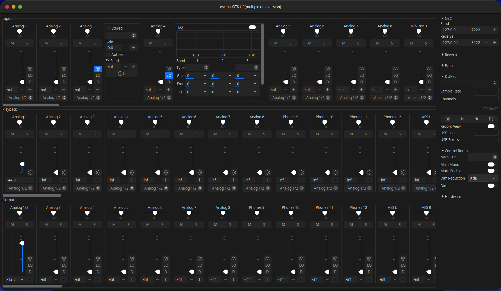
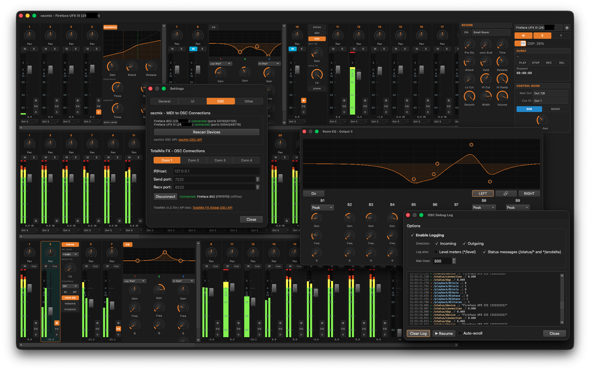
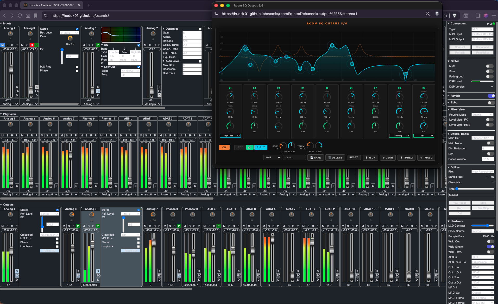

# oscmix for RME Fireface UFX+ on Linux

This project adapts oscmix for the **RME Fireface UFX+** running in
**Class Compliant (CC)** mode on Linux. Its lightweight GTK4 mixer provides a
TotalMix-inspired control surface while preserving the OSC/MIDI engine and
design of [huddx01/oscmix](https://github.com/huddx01/oscmix), itself derived
from [michaelforney/oscmix](https://github.com/michaelforney/oscmix). The
original authors and licenses remain credited in [LICENSE](LICENSE).

> [!WARNING]
> This is experimental remote-control software for audio hardware. Test new
> versions with monitor levels reduced and do not rely on it as the only way to
> mute a high-level signal.

> [!NOTE]
> This is an independent, unofficial project. It is not sponsored, authorized,
> endorsed by, or affiliated with RME Audio. RME and TotalMix are trademarks of
> their respective owners.

## UFX+ and GTK4 highlights

- automatic UFX+ detection, heartbeat monitoring and reconnection after USB or
  ALSA re-enumeration, without machine-specific port numbers;
- display of the actual hardware gain value when the application opens;
- startup restoration of the last mixer matrix controlled by the GTK 4 app;
- standard 24-channel direct playback routing is shown on the first launch,
  until a route is changed or restored;
- analog inputs 1–8: 0 to 12 dB gain;
- microphone preamps 9–12: 0 dB or 8 to 75 dB;
- Hi-Z instrument inputs 9–12: 8 to 50 dB;
- dynamic gain-control ranges in the GTK interface;
- double-click directly on a fader handle or track to return it to the nominal
  0 dB level;
- TotalMix-style stereo pairing with one strip and one fader, plus separate
  left and right meters;
- an interlocking-ring indicator on every active stereo-paired strip;
- Pan/Balance followed by Mute and Solo buttons above the meters;
- double-click on Pan/Balance, including the inspector slider, to recenter it;
- a per-strip EQ button that inserts the editor directly after that fader,
  shifts the following strips and never overlays another mixer row;
- a synchronized EQ tab in a collapsible side inspector, with a new-window
  icon that opens a separate resizable EQ window;
- draggable, numbered EQ graph nodes for frequency and gain, with Q controlled
  by the mouse wheel after selecting a node;
- double-click gain reset to 0 dB on EQ graph nodes;
- Ctrl-drag fine adjustment at one-tenth sensitivity for EQ controls and graph
  nodes;
- normalized discrete wheel steps, with Ctrl-wheel fine adjustment for
  continuous EQ parameters;
- compact inline, inspector and detachable Dynamics editors for inputs and
  hardware outputs, including a graduated -60-to-0 dB Compressor/Expander
  transfer graph with separate threshold markers;
- live input meters beside the EQ and Dynamics graphs in every editor mode;
- a moving input-level point on the Dynamics transfer curve plus a dedicated
  precise 0 to -20 dB gain-reduction meter in both the embedded and detached
  Dynamics editors;
- double-clicking non-control space in an EQ or Dynamics panel opens its
  detached window without intercepting parameter double-click actions;
- a TotalMix-style light-blue gain-reduction indicator integrated into every
  Dynamics-enabled input and hardware-output meter;
- parameter-aware Attack and Release ballistics for the UFX+ gain-reduction
  fallback, while native hardware gain-reduction data keeps priority;
- compact Room EQ in the inspector plus a synchronized, independently
  resizable window with all nine hardware bands;
- nine colored, numbered Room EQ graph nodes with frequency/gain dragging,
  wheel-controlled Q, Ctrl fine adjustment and double-click gain reset;
- per-band Room EQ enable controls and optional stereo output linking;
- submix-local Solo-in-Place without overwriting the stored fader positions.

## Compatibility

| Component | Status |
|---|---|
| Fireface UFX+ over USB in CC Mode | Primary development and test target |
| Linux with ALSA and GTK 4.6+ | Supported GTK4 environment |
| Thunderbolt control on Linux | Not supported |
| Other RME interfaces | Inherited engine support; GTK4 behavior is not validated here |

The UFX+ must expose its Class Compliant USB MIDI control port. TotalMix FX is
not required, and the application does not communicate with the interface
through OSC directly: the local oscmix engine translates OSC commands to the
device's MIDI SysEx protocol.

## Quick start

1. Put the UFX+ in **CC Mode** and connect it to the Linux computer over
   **USB**. The MIDI CC/SysEx control used here is not available over
   Thunderbolt.
2. Install the build dependencies on Debian or Ubuntu:

   ```shell
   sudo apt update
   sudo apt install -y build-essential libasound2-dev pkg-config \
     libgtk-4-dev libavahi-client-dev git
   ```

3. Clone, build, test and install the local application:

   ```shell
   git clone https://github.com/charlysound/oscmix-ufxplus-linux.git
   cd oscmix-ufxplus-linux
   make -j2 oscmix alsaseqio gtk4
   make -C gtk4 check
   make -C gtk4 install-local
   ```

4. Start **oscmix GTK4 – UFX+ Prototype** from the desktop application menu.

The installed launcher discovers the UFX+ by its ALSA device name rather than
remembering a temporary numeric port. It keeps the GUI open and reconnects the
backend after USB or ALSA re-enumeration. See the
[GTK4 implementation guide](gtk4/README.md) for architecture and control
details.

## Project status

The UFX+ GTK4 frontend is under active development. Core routing, gain,
stereo pairing, metering, EQ, Dynamics, Room EQ and reconnection workflows are
implemented, but wider hardware and firmware testing is still needed. Reports
should include the interface model, firmware version, Linux distribution and
steps required to reproduce the problem.

## Professional GTK 4 prototype

A new lightweight interface is developed in [`gtk4`](gtk4). It remains
separate from the existing GTK 3 interface while it is validated on the UFX+.

Key architectural differences:

- the 94 × 188 matrix is stored in compact arrays, without one GTK object per route;
- three GSK-drawn mixer rows with horizontal virtualization;
- OSC transport runs in a dedicated thread;
- the compact per-channel EQ editor is inserted into its mixer row, is also
  available in the inspector and can be detached into a larger responsive
  window;
- the Dynamics editor follows the same inline/inspector/detached workflow, with
  live input and gain-reduction meters plus output-strip GR indication;
- meters animate at 60 FPS and are suspended while the window is minimized.

As in TotalMix FX, Solo affects input and playback strips in the current
submix. The hardware-output row shows the `S` button as unavailable: an output
is the submix destination, not a source that can be soloed within that submix.

Build and install the separate local launcher:

```sh
sudo apt install libgtk-4-dev
make gtk4
make -C gtk4 check
make -C gtk4 install-local
```

The local installation adds **oscmix GTK4 – UFX+ Prototype** to the application
menu without replacing the GTK 3 launcher.

The UFX+ CC register dump does not include its routing matrix. The GTK 4 app
therefore stores the matrix it controls under the user's XDG state directory
and restores it at the next launch. On the first launch only, it displays the
standard direct 24-channel Playback-to-Output routing at 0 dB. Loading this
display state does not write routes to the interface.

[](https://github.com/charlysound/oscmix-ufxplus-linux/actions/workflows/gtk4-check.yml)

oscmix implements an OSC API for some RME's Fireface units running in
class-compliant mode, allowing full control of the device's
functionality through OSC on POSIX operating systems supporting USB
MIDI.

## Inherited device support

The GTK4 application in this repository targets the UFX+. The engine and legacy
frontends retain the broader device work from upstream; those paths may have
different maturity and are not all tested by this project's maintainer.

### Upstream-supported device

- RME Fireface UCX II

### Devices with work-in-progress support

- RME Fireface 802
- RME Fireface UCX
- RME Fireface UFX
- RME Fireface UFX II
- RME Fireface UFX III
- RME Fireface UFX+

## Download

Pre-release source snapshots, an `amd64` Debian package and GTK4 UFX+ AppImages
are available on the
[Releases page](https://github.com/charlysound/oscmix-ufxplus-linux/releases).
Install a downloaded package with:

```shell
sudo apt install ./oscmix-ufxplus_VERSION_amd64.deb
```

Alternatively, make the AppImage for your architecture executable and run it:

```shell
chmod +x oscmix-ufxplus-gtk4-VERSION-x86_64.AppImage
./oscmix-ufxplus-gtk4-VERSION-x86_64.AppImage
```

The AppImage bundles GTK4 and the application binaries. Device discovery still
uses the host's ALSA utilities, so install `alsa-utils` if `aconnect` is not
already available.

There is no stable release yet. Build from source as described below when a
package or AppImage is not available for your architecture; binaries published
by the upstream project may behave differently.

## Building

If you prefer building your own from the sources, follow the steps below...

### 1. Install Dependencies

#### For Debian/Ubuntu:
```shell
sudo apt update
sudo apt install -y libasound2-dev pkg-config libgtk-3-dev libglib2.0-dev libavahi-client-dev clang lld git
```
#### For Darwin(macOS):
Xcode Command Line Tools or Xcode are required. Bonjour (mDNS) is built into macOS.

```sh
xcode-select --install
```

### 2. Download Repository

Clone this UFX+ variant:

```shell
git clone https://github.com/charlysound/oscmix-ufxplus-linux.git
cd oscmix-ufxplus-linux
```

Clone the upstream fork without the changes specific to this branch:

```shell
git clone https://github.com/huddx01/oscmix.git
cd oscmix
git switch dev
```

### 3. Build
From the oscmix dir, use make to build the binaries.
```shell
make oscmix
make alsaseqio
make alsarawio
make gtk
make tools/regtool
```
If you want to build the wasm too (needed for own webserver), you'll need additional dependencies. 
See: https://github.com/huddx01/oscmix/tree/dev?tab=readme-ov-file#web-ui

## General Oscmix Usage

```
oscmix [-dhlz] [-m [port]] [-p midiport] [-r recvaddr] [-s sendaddr]
```

oscmix reads and writes MIDI SysEx messages from/to file descriptors
6 and 7 respectively, which are expected to be opened by `alsarawio`,
`alsaseqio` (Linux) or `coremidiio` (macOS).

By default, oscmix will listen for OSC messages on `udp!127.0.0.1!7222`
and send to `udp!127.0.0.1!8222`.

| Flag | Description |
|------|-------------|
| `-d` | Enable debug output |
| `-h` | Show help and exit |
| `-l` | Disable level metering |
| `-m [port]` | Send OSC updates to multicast address `224.0.0.1` on given port (default: `8222`) |
| `-p midiport` | MIDI port name (default: `$MIDIPORT` env var) |
| `-r addr` | OSC receive address (default: `udp!127.0.0.1!7222`) |
| `-s addr` | OSC send address (default: `udp!127.0.0.1!8222`) |
| `-z` | Zeroconf - Register OSC service via mDNS/DNS-SD (`_osc._udp`) for automatic service discovery |

The engine also accepts `/metering ,i 0|1`. The new interface uses it to stop
level requests while minimized.

See the manual pages for more information: `man oscmix`, `man alsaseqio`, `man alsarawio`, `man coremidiio`.

### mDNS / DNS-SD Discovery

When started with `-z`, oscmix registers itself as an `_osc._udp` service on the local network.
On Linux this uses [Avahi](https://avahi.org); on macOS Bonjour is used (no extra dependencies).

mDNS / DNS-SD Discovery Implementation is based and according the [OSC v.1.1 spec](https://ccrma.stanford.edu/groups/osc/spec-1_1.html).
For details see [NIME 2009 paper](https://ccrma.stanford.edu/groups/osc/files/2009-NIME-OSC-1.1.pdf).

The registered service includes device metadata (name, serial, channel count, ports) so that
compatible clients — including the oscmix Qt UI — can discover and connect automatically
without manual IP/port configuration.

```sh
# Start with multicast output and mDNS registration
alsaseqio 16:3 oscmix -m -z

# Use a custom multicast port
alsaseqio 16:3 oscmix -m 8233 -z

# Verify registration on Linux
avahi-browse _osc._udp

# Verify registration on macOS
dns-sd -B _osc._udp local
```

## Running

### Linux

On Linux systems, you can use alsarawio or asaseqio to run oscmix.

#### 1. alsarawio

On Linux systems, you can use bundled `alsarawio` program open and
configure a given raw MIDI subdevice and set up these file descriptors
appropriately.

To determine your MIDI device, look for it in the output of `amidi -l`.
(the last ending port with the name `Fireface xyz...`).

Example:

```sh
$ amidi -l
Dir Device    Name
IO  hw:0,0,0  Fireface UFX III (xxxxxxxx) Por
IO  hw:0,0,1  Fireface UFX III (xxxxxxxx) Por
IO  hw:0,0,2  Fireface UFX III (xxxxxxxx) Por
IO  hw:0,0,3  Fireface UFX III (xxxxxxxx) Por
```

We use the last port from the result above to run oscmix:

```sh
alsarawio 0,0,3 oscmix
```


#### 2. alsaseqio

There is also a tool `alsaseqio` that requires alsa-lib and uses
the sequencer API.

To determine the client and port for your device, find the client
and the last port in the output of `aconnect -l` for your device.

Example:
```sh
$ aconnect -l
...
client 16: 'Fireface UFX III (xxxxxxxx)' [type=Kernel,card=0]
    0 'Fireface UFX III (xxxxxxxx) Por'
    1 'Fireface UFX III (xxxxxxxx) Por'
    2 'Fireface UFX III (xxxxxxxx) Por'
    3 'Fireface UFX III (xxxxxxxx) Por'
...
```
We use the client and last port from the result above to run oscmix:
```sh
alsaseqio 16:3 oscmix
```

With multicast output and mDNS registration:
```sh
alsaseqio 16:3 oscmix -m -z
```

### BSD

On BSD systems, you can launch oscmix with file descriptors 6 and
7 redirected to the appropriate MIDI device.

For example:

```sh
oscmix 6<>/dev/rmidi1 7>&6
```

### macOS (Darwin)

On macOS (Darwin) systems, you can build and launch oscmix, too.

At least, Xcode Command Line Tools are neccesary (not needed if you have Xcode installed). 

You can install the Xcode Command Line Tools via:

```sh
xcode-select --install
```

Afterwards, go to the cloned oscmix directory (assure you are on dev branch) and build oscmix and coremidiio via:

```sh
make oscmix coremidiio
```

If this is done, check your port number and remember the exact name of your unit:

```sh
./coremidiio -l
```

For example, if your unit would appear like this...
"4  	Fireface 802 (12345678) Port 2"
...the corresponding command would be:

```sh
./coremidiio -f 6,7 -p 4 ./oscmix -p 'Fireface 802 (12345678) Port 2'
```

> [!NOTE]
> You can also set MIDIPORT env variable to 'Fireface 802 (12345678) Port 2' in this example.

With multicast output and mDNS registration:

```sh
./coremidiio -f 6,7 -p 4 ./oscmix -m -z
```


## GTK UI

The [gtk](gtk) directory contains oscmix-gtk, a GTK frontend that
communicates with oscmix using OSC.



### Running GTK UI
To run oscmix-gtk without installing, set the `GSETTINGS_SCHEMA_DIR`
environment variable.

```sh
GSETTINGS_SCHEMA_DIR=$PWD/gtk ./gtk/oscmix-gtk
```

## Qt UI *(Early WIP)*

> [!NOTE]
> This is a first rough draft after only a few days of learning Qt - expect rough edges.
> Sources will follow once it's in a shareable state.
> 
> NEW: A pre-built binary (for first try-out) is available in the [Releases](https://github.com/huddx01/oscmix/releases)
> 
> For a current feature description see the [oscmix Qt UI wiki page](https://github.com/huddx01/oscmix/wiki/oscmixQt)



### Why Qt?

- **Native experience** - proper window chrome, system fonts, and trackpad scrolling that GTK can't match on Linux and macOS
- **Universal Code** - no change of one single code line needed for building on each system (Linux/macOS/Windows). While the UI exacly looks the same on all. 
- **Open GL/Metal** - Qt supports direct graphics engine support for all systems, without further hassles...

### Your input wanted

This frontend is at the stage where your feedback shapes the direction. Two things are especially useful right now:

1. **What matters to you in the UI?** Missing controls, layout preferences, workflow details - just open an issue.
2. **GTK vs. Qt priority?** Development time is finite. If you actively use or plan to use the Qt frontend, let me know via issue - it directly influences where time goes.

## Web UI

The [web](web) directory contains a web frontend that can communicate
with oscmix through OSC over a WebSocket, or by directly to an
instance of oscmix compiled as WebAssembly running directly in the browser.




The web UI for this fork/dev branch is automatically deployed at
[https://huddx01.github.io/oscmix](https://huddx01.github.io/oscmix).

It is tested primarily against the chromium stable channel, but
patches to support other/older browsers are welcome (if it doesn't
complicate things too much).

Also included is a UDP-to-WebSocket bridge, `wsdgram`. It expects
file descriptors 0 and 1 to be an open connection to a WebSocket
client. It forwards incoming messages to a UDP address and writes
outgoing messages for any UDP packet received. Use it in combination
with software like [s6-tcpserver] or [s6-tlsserver].

```sh
s6-tcpserver 127.0.0.1 8222 wsdgram
```

To build `oscmix.wasm`, you need `clang` supporting wasm32, `wasm-ld`,
and `wasi-libc`.

[s6-tcpserver]: https://skarnet.org/software/s6-networking/s6-tcpserver.html
[s6-tlsserver]: https://skarnet.org/software/s6-networking/s6-tlsserver.html

## OSC API

For current state of full OSC API reference, see the [oscmix OSC API](https://github.com/huddx01/oscmix/wiki/oscmix-OSC-API) wiki page.

## Contributing

Bug reports, hardware verification, documentation and focused pull requests are
welcome. Read [CONTRIBUTING.md](CONTRIBUTING.md) before submitting changes.
External contributors normally work in a fork and open a pull request; only
maintainers can merge changes into this repository.

Please use the issue templates and keep application text and project
documentation in English. Security-sensitive reports must follow
[SECURITY.md](SECURITY.md) and must not be posted as public issues.

## License

The project retains the permissive license and third-party notices in
[LICENSE](LICENSE). Contributions are distributed under those existing terms.
Keep all copyright and license notices when redistributing modified versions.

## Thanks

- [@juanramoncastan](https://github.com/juanramoncastan) - UFX II verifications, UI improvements, layout fixes and valuable suggestions ([#5](https://github.com/huddx01/oscmix/issues/5))

- [@Sojuzstudio](https://github.com/Sojuzstudio) - Special thanks - for lots of tipps, ideas, testing with own hw on linux, and very useful feedback regarding oscmixQt UI and much more!
